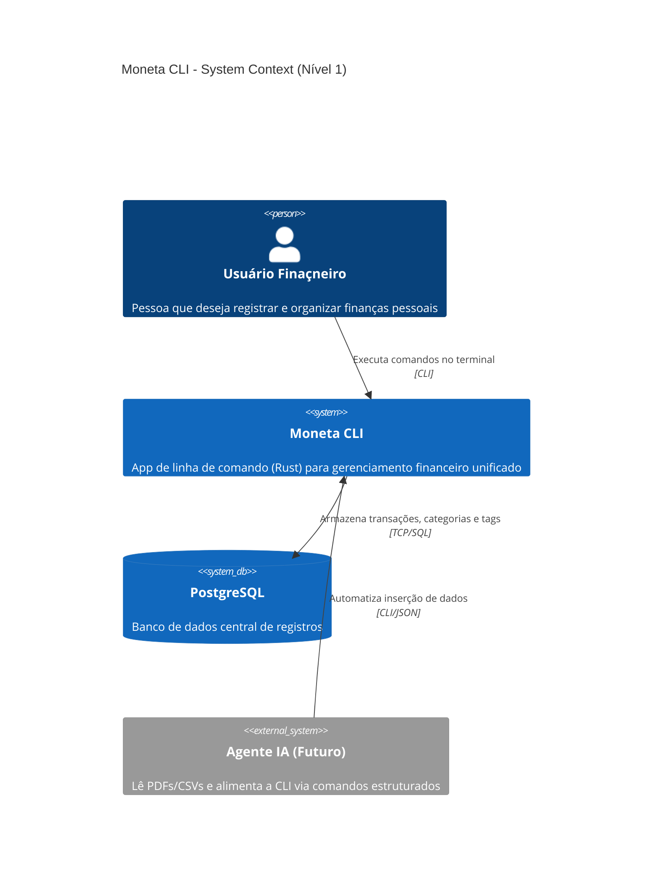
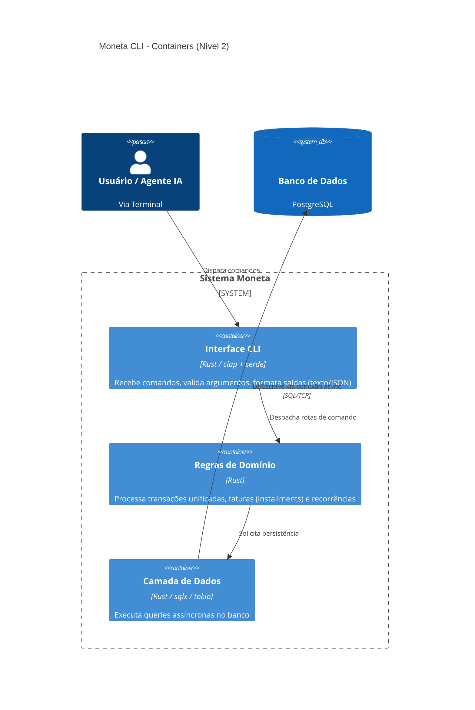

# Arquitetura Moneta CLI (C4 Model)

Este documento descreve a arquitetura do projeto utilizando diagramas estruturados no formato C4 Model via Mermaid.

## Nível 1: Contexto do Sistema (System Context)

Mostra o panorama geral: o usuário, o sistema Moneta e agentes externos.

## Nível 2: Containers

Aplica um zoom no sistema "Moneta CLI" para mostrar os blocos de construção técnicos.

