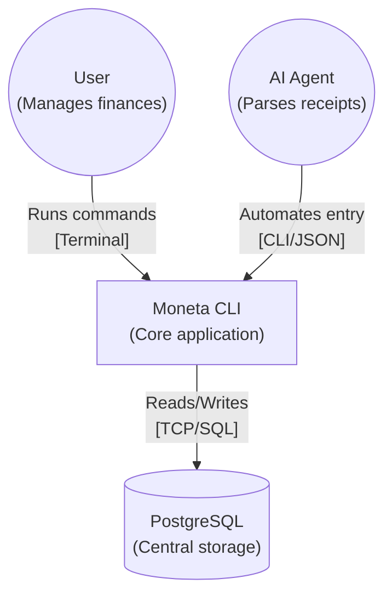
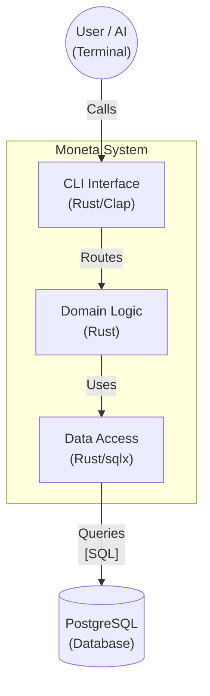
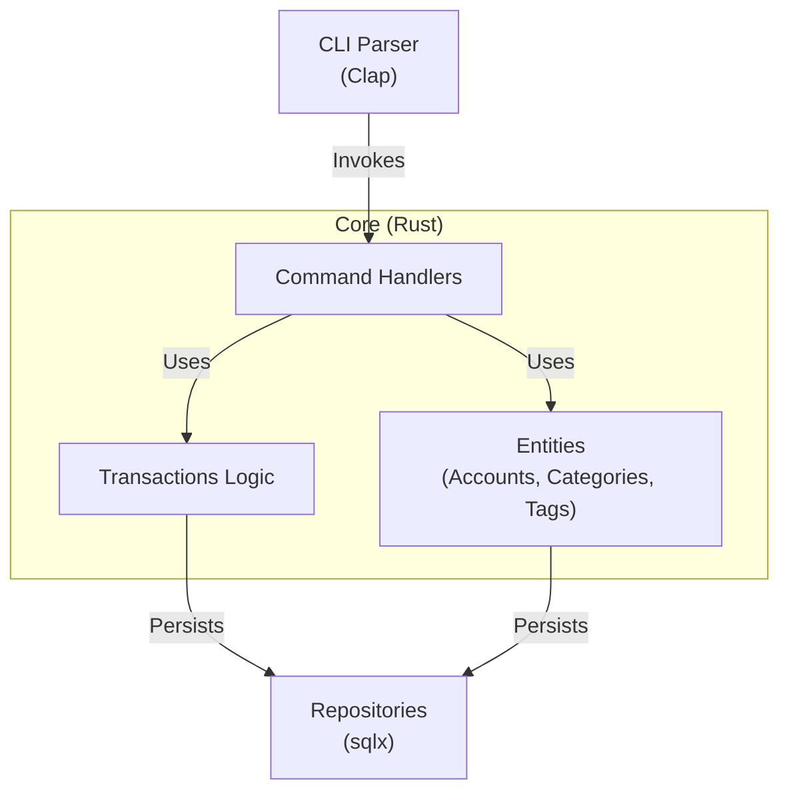
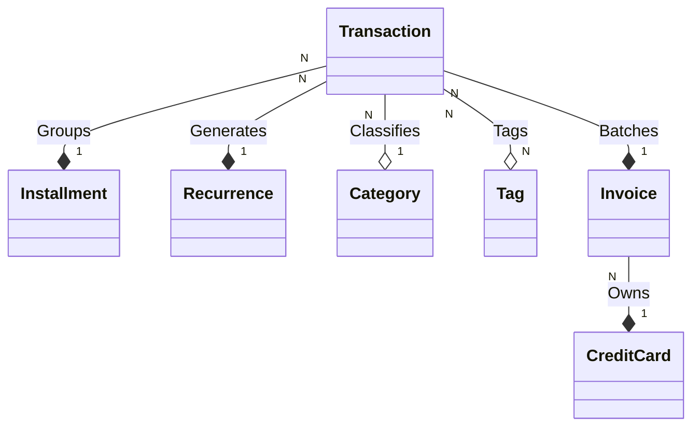
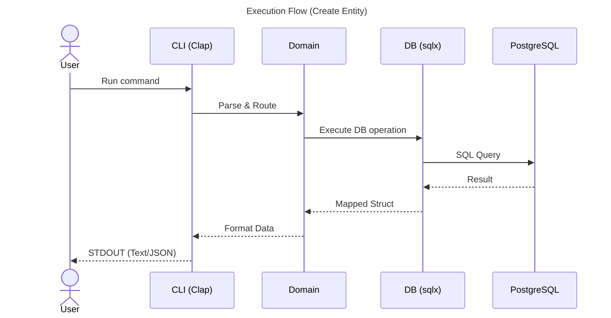

# Moneta CLI Architecture

## Level 1: System Context (C4)

```mermaid
flowchart TD
  User(("User\n(Manages finances)"))
  AI(("AI Agent\n(Parses receipts)"))
  Moneta["Moneta CLI\n(Core application)"]
  DB[("PostgreSQL\n(Central storage)")]

  User -- "Runs commands\n[Terminal]" --> Moneta
  AI -- "Automates entry\n[CLI/JSON]" --> Moneta
  Moneta -- "Reads/Writes\n[TCP/SQL]" --> DB
```

## Level 2: Containers (C4)

```mermaid
flowchart TD
  User(("User / AI\n(Terminal)"))

  subgraph Moneta["Moneta System"]
    direction TB
    CLI["CLI Interface\n(Rust/Clap)"]
    Core["Domain Logic\n(Rust)"]
    DBLayer["Data Access\n(Rust/sqlx)"]
  end

  DB[("PostgreSQL\n(Database)")]

  User -- "Calls" --> CLI
  CLI -- "Routes" --> Core
  Core -- "Uses" --> DBLayer
  DBLayer -- "Queries\n[SQL]" --> DB
```

## Level 3: Components (C4)

```mermaid
flowchart TD
  CLI["CLI Parser\n(Clap)"]

  subgraph Core["Core (Rust)"]
    direction TB
    Cmd["Command Handlers"]
    Tx["Transactions Logic"]
    Entities["Entities\n(Accounts, Categories, Tags)"]
  end

  DBLayer["Repositories\n(sqlx)"]

  CLI -- "Invokes" --> Cmd
  Cmd -- "Uses" --> Tx
  Cmd -- "Uses" --> Entities
  Tx -- "Persists" --> DBLayer
  Entities -- "Persists" --> DBLayer
```

## Level 4: Domain Classes (UML)

```mermaid
classDiagram
  direction BT

  class Transaction
  class Installment
  class Recurrence
  class Category
  class Tag
  class CreditCard
  class Invoice

  Installment "1" *-- "N" Transaction : Groups
  Recurrence "1" *-- "N" Transaction : Generates
  Category "1" o-- "N" Transaction : Classifies
  Tag "N" o-- "N" Transaction : Tags
  Invoice "1" *-- "N" Transaction : Batches
  CreditCard "1" *-- "N" Invoice : Owns
```

## Level 4: Execution Flow (UML)

```mermaid
sequenceDiagram
  title Execution Flow (Create Entity)

  actor User
  participant CLI as CLI (Clap)
  participant Core as Domain
  participant Repo as DB (sqlx)
  participant PG as PostgreSQL

  User->>CLI: Run command
  CLI->>Core: Parse & Route
  Core->>Repo: Execute DB operation
  Repo->>PG: SQL Query
  PG-->>Repo: Result
  Repo-->>Core: Mapped Struct
  Core-->>CLI: Format Data
  CLI-->>User: STDOUT (Text/JSON)
```
